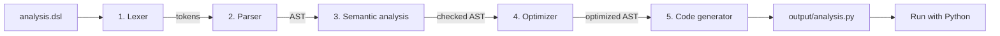

# Data Analysis DSL Compiler

[](https://github.com/vivekvardhan12/dsl-compiler/actions/workflows/tests.yml)


A compiler for a small, beginner-friendly **data analysis language**. You write
plain commands like `filter marks > 60`; the compiler checks them, optimizes
them, translates them into **Python/pandas** code, and runs the result.

Built as a **Compiler Design** course project. It implements every classic
compiler phase by hand - lexer, recursive descent parser, semantic analysis
with a symbol table, optimizer, and code generator - with no parser-generator
libraries.

```text
load "examples/students.csv"
filter marks > 60
select name, city, marks
sort marks desc
show
print avg(marks)
```

```text
  name      city  marks
 Arjun     Delhi     95
 Rohan Bengaluru     91
Ananya      Pune     88
 Priya Bengaluru     81
 Aarav Hyderabad     78
Vikram   Chennai     72
 Sneha Hyderabad     64

avg(marks) = 81.29
```

---

## Table of contents

- [Features](#features)
- [Tech stack](#tech-stack)
- [How it works](#how-it-works)
- [Installation](#installation)
- [Usage](#usage)
- [The language](#the-language)
- [Error messages](#error-messages)
- [Project structure](#project-structure)
- [Testing](#testing)
- [Troubleshooting](#troubleshooting)
- [Limitations and future work](#limitations-and-future-work)
- [Contributing](#contributing)
- [License](#license)

---

## Features

- **Seven commands:** `load`, `filter`, `select`, `sort`, `show`, `print`
  (count / sum / avg / min / max) and `plot` (bar / line / scatter charts).
- **All five compiler phases**, each in its own module and runnable on its own.
- **Clear error messages** with line, column and a caret (`^`) under the
  problem - plus "Did you mean 'marks'?" suggestions for misspelled columns.
- **Static type checking:** column types are inferred from the CSV at compile
  time, so `print avg(name)` is rejected before anything runs.
- **Optimizer** with five passes: dead code elimination, filter pushdown,
  filter merging, redundant sort removal and redundant select removal.
- **Readable output:** the generated Python is commented line-by-line with
  the DSL statement it came from.
- **Secure code generation:** user strings are emitted with `repr()`, so a
  malicious `.dsl` file cannot inject Python code.
- **170 automated tests, 99% branch coverage**, run by GitHub Actions on
  Linux and Windows.

## Tech stack

| Purpose                       | Tool                                 |
| ----------------------------- | ------------------------------------ |
| Language                      | Python 3.12+                         |
| Data processing (target code) | pandas                               |
| Charts (target code)          | matplotlib                           |
| Testing                       | pytest, pytest-cov                   |
| CI                            | GitHub Actions                       |
| Lexer, parser, optimizer      | Hand-written - no external libraries |

## How it works



| Phase                | File               | Input → Output        | Catches                                 |
| -------------------- | ------------------ | --------------------- | --------------------------------------- |
| 1. Lexical analysis  | `src/lexer.py`     | text → tokens         | `filter marks @ 60` (invalid character) |
| 2. Syntax analysis   | `src/parser.py`    | tokens → AST          | `filter > 60` (wrong order)             |
| 3. Semantic analysis | `src/semantic.py`  | AST → checked AST     | `filter mark > 60` (no such column)     |
| 4. Optimization      | `src/optimizer.py` | AST → smaller AST     | - (improves, never rejects)             |
| 5. Code generation   | `src/codegen.py`   | AST → Python code     | -                                       |
| Driver               | `src/main.py`      | runs all of the above |                                         |

See [docs/architecture.md](docs/architecture.md) for the full design.

## Installation

You need [Anaconda](https://www.anaconda.com/download) (or any Python 3.12+)
and [Git](https://git-scm.com/downloads).

```bash
git clone https://github.com/vivekvardhan12/dsl-compiler.git
cd dsl-compiler

conda create -n dslc python=3.13 -y
conda activate dslc
pip install -r requirements.txt
```

Check it works:

```bash
python src/main.py examples/analysis.dsl
```

## Usage

Always run commands from the project root - CSV paths in `.dsl` files are
relative to it.

```bash
python src/main.py <file.dsl> [options]
```

| Option          | Shows / does                                                |
| --------------- | ----------------------------------------------------------- |
| _(none)_        | Compile to `output/<name>.py` and run it                    |
| `--tokens`      | Phase 1 output: the token list                              |
| `--ast`         | Phase 2 output: the syntax tree                             |
| `--symbols`     | Phase 3 output: the symbol table after each statement       |
| `--opt`         | Phase 4 output: what the optimizer changed + optimized tree |
| `--code`        | Phase 5 output: the generated Python                        |
| `--all`         | All of the above                                            |
| `--no-run`      | Compile only                                                |
| `--no-optimize` | Skip the optimizer (compare with/without)                   |
| `-o DIR`        | Write generated files to `DIR` instead of `output/`         |

**Try the examples:**

```bash
python src/main.py examples/analysis.dsl --all       # every phase, step by step
python src/main.py examples/optimize_demo.dsl --opt  # optimizer in action
python src/main.py examples/plot_demo.dsl            # bar chart
python src/main.py examples/lexer_error.dsl          # lexical error
python src/main.py examples/parser_error.dsl         # syntax error
python src/main.py examples/semantic_error.dsl       # semantic error
```

Each phase can also be run on its own:

```bash
python src/lexer.py     examples/analysis.dsl
python src/parser.py    examples/analysis.dsl
python src/semantic.py  examples/analysis.dsl
python src/optimizer.py examples/optimize_demo.dsl
python src/codegen.py   examples/analysis.dsl
```

## The language

| Command  | Example               | Meaning                                          |
| -------- | --------------------- | ------------------------------------------------ |
| `load`   | `load "data.csv"`     | Read a CSV file (must come first)                |
| `filter` | `filter marks >= 60`  | Keep matching rows (`>` `<` `>=` `<=` `==` `!=`) |
| `select` | `select name, marks`  | Keep only these columns                          |
| `sort`   | `sort marks desc`     | Order rows (`asc` is the default)                |
| `show`   | `show`                | Print the table                                  |
| `print`  | `print avg(marks)`    | Print `count`, `sum`, `avg`, `min` or `max`      |
| `plot`   | `plot bar name marks` | Chart: `bar`, `line` or `scatter`                |

Comments start with `#`. Keywords are case-insensitive; column names are not.
Full grammar, type rules and examples: [docs/language-reference.md](docs/language-reference.md).

## Error messages

Every phase reports errors in the same format:

```text
Semantic error at line 5, column 1: Unknown column 'mark' in 'filter'. Did you mean 'marks'? Available columns: name, marks
    filter mark > 60
    ^
```

## Project structure

```text
dsl-compiler/
├── src/
│   ├── tokens.py        # token types and keyword table
│   ├── errors.py        # error classes with line/column formatting
│   ├── lexer.py         # Phase 1: lexical analysis
│   ├── ast_nodes.py     # AST node classes and tree printer
│   ├── parser.py        # Phase 2: recursive descent parser
│   ├── semantic.py      # Phase 3: symbol table, type inference, checks
│   ├── optimizer.py     # Phase 4: five optimization passes
│   ├── codegen.py       # Phase 5: Python/pandas code generation
│   └── main.py          # compiler driver (command-line interface)
├── tests/               # 170 pytest tests (unit, integration, equivalence)
├── examples/            # sample .dsl programs and students.csv
├── docs/                # language reference, architecture, viva notes
├── output/              # generated .py files and charts (git-ignored)
├── .github/workflows/   # GitHub Actions CI
├── .coveragerc          # coverage settings (95% minimum)
├── pytest.ini           # pytest settings
└── requirements.txt     # dependencies
```

## Testing

```bash
pytest                              # run all 170 tests
pytest -v                           # one line per test
pytest --cov                        # with coverage (fails below 95%)
pytest --cov --cov-report=html      # browsable report: htmlcov/index.html
pytest tests/test_parser.py         # one file only
```

| Test file            | Tests | What it covers                                                 |
| -------------------- | ----- | -------------------------------------------------------------- |
| `test_lexer.py`      | 22    | Tokens, operators, comments, line/column, lexical errors       |
| `test_parser.py`     | 27    | Every grammar rule and syntax error                            |
| `test_semantic.py`   | 24    | Type inference, symbol table, every semantic check             |
| `test_optimizer.py`  | 21    | Each optimization + **equivalence** (same output with/without) |
| `test_codegen.py`    | 21    | Generated code text **and** running it; injection safety       |
| `test_main.py`       | 14    | End-to-end: the whole compiler as a user runs it               |
| `test_cli.py`        | 24    | Each phase's stand-alone command                               |
| `test_edge_cases.py` | 17    | Rare cases found through the coverage report                   |

CI runs all tests on Ubuntu and Windows with Python 3.12 and 3.13 on every push.

## Troubleshooting

| Problem                                                   | Fix                                                                                                                            |
| --------------------------------------------------------- | ------------------------------------------------------------------------------------------------------------------------------ |
| `ModuleNotFoundError: No module named 'pandas'`           | Run `conda activate dslc` first, then `pip install -r requirements.txt`                                                        |
| `File not found: "examples/students.csv"`                 | Run the command from the project root folder, not from `src/`                                                                  |
| `PermissionError: [WinError 5] Access is denied` in tests | Use a normal (non-Administrator) prompt; close other Python processes. `pytest.ini` already keeps temp files in `.pytest_tmp/` |
| `'code' is not recognized`                                | Reinstall VS Code with "Add to PATH" ticked                                                                                    |
| Chart window doesn't appear                               | The chart is still saved in `output/` - open the `.png`                                                                        |
| Box characters (`├──`) look wrong                         | Old Windows console; output is still correct. Use Windows Terminal                                                             |

## Limitations and future work

- Stops at the first error (no panic-mode error recovery yet).
- Semantic errors point at the start of the statement, not the exact word.
- No `group by`, joins, computed columns or `and`/`or` inside one filter.
- Type inference reads the whole CSV; very large files would use a sample.

## Contributing

1. Fork the repository and create a branch: `git checkout -b feature/group-by`
2. Make your change **with tests** - coverage must stay at or above 95%.
3. Run `pytest --cov` and make sure everything passes.
4. Commit with a clear message and open a pull request.

## License

[MIT](LICENSE) © 2026 Vivek Vardhan

## Acknowledgements

- _Compilers: Principles, Techniques, and Tools_ (Aho, Lam, Sethi, Ullman) -
  the "Dragon Book", for the phase structure and terminology.
- [Crafting Interpreters](https://craftinginterpreters.com/) by Robert Nystrom,
  for the hand-written scanner and recursive descent approach.
- The [pandas](https://pandas.pydata.org/) and [pytest](https://pytest.org/) projects.
