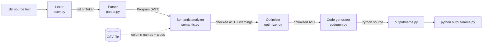
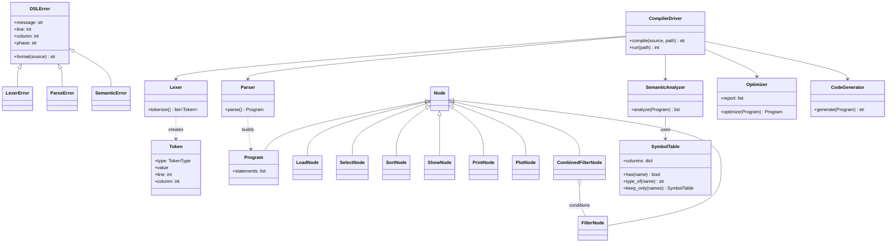
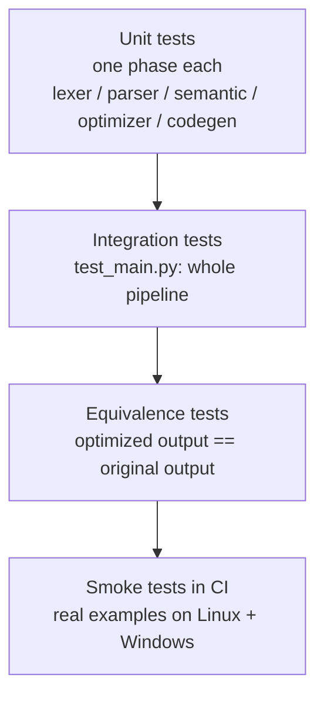

# Architecture

This document explains how the compiler is built and why. Diagrams use
Mermaid, which GitHub renders automatically.

---

## 1. Overview: a pipeline of phases



Each phase has **one job**, takes the previous phase's output as input, and
can be run and tested on its own. This is the classic compiler structure from
the Dragon Book, and it applies the **Single Responsibility Principle**.

| Phase | Front/Back end | Input | Output | Data structure |
|---|---|---|---|---|
| Lexer | Front end | `str` | `list[Token]` | Token stream |
| Parser | Front end | `list[Token]` | `Program` | Abstract Syntax Tree |
| Semantic analyzer | Front end | `Program` | warnings (or `SemanticError`) | Symbol table |
| Optimizer | Middle end | `Program` | new `Program` | Basic blocks |
| Code generator | Back end | `Program` | `str` (Python) | Templates |

---

## 2. Sequence: what happens on `python src/main.py prog.dsl`

```mermaid
sequenceDiagram
    actor User
    participant Main as main.py
    participant Lex as Lexer
    participant Par as Parser
    participant Sem as SemanticAnalyzer
    participant Opt as Optimizer
    participant Gen as CodeGenerator
    participant Py as Python process

    User->>Main: python src/main.py prog.dsl
    Main->>Main: read prog.dsl
    Main->>Lex: tokenize(source)
    Lex-->>Main: tokens
    Main->>Par: parse(tokens)
    Par-->>Main: AST
    Main->>Sem: analyze(AST)
    Sem->>Sem: open CSV, infer column types
    Sem-->>Main: warnings
    Main->>Opt: optimize(AST)
    Opt-->>Main: optimized AST + report
    Main->>Gen: generate(AST)
    Gen-->>Main: Python code
    Main->>Main: write output/prog.py
    Main->>Py: subprocess.run([python, output/prog.py])
    Py-->>User: tables, values, charts
    Note over Main,Sem: Any phase may raise a DSLError.<br/>main.py prints it with line/column and exits with code 1.
```

---

## 3. Class diagram



---

## 4. Phase by phase

### 4.1 Lexer (`lexer.py`, `tokens.py`)
- **Technique:** a hand-written scanner. A pointer walks the text; the
  *first character* of each token decides how to read the rest.
- **Maximal munch:** `>=` is one token, not `>` then `=`.
- Every token stores its **line and column** for error messages.
- Keywords are matched case-insensitively; identifiers keep their case.
- **Complexity:** O(n) time and space for n characters.

### 4.2 Parser (`parser.py`, `ast_nodes.py`)
- **Technique:** recursive descent - one method per grammar rule.
- **LL(1):** one token of lookahead picks the rule; there is no backtracking.
- A dispatch table maps the first token type to the rule method, so adding
  a command means adding one entry (**Open/Closed Principle**).
- Produces an **AST**: brackets, commas and newlines are dropped; only the
  meaning remains, as `@dataclass` nodes.
- **Complexity:** O(n) in the number of tokens.

### 4.3 Semantic analysis (`semantic.py`)
- **Symbol table:** maps each column of the *current* table to `number` or
  `text`. `load` builds it from the CSV; `select` replaces it with a smaller
  one - so column visibility behaves like **scope**.
- **Type inference:** a column is `number` if every non-empty value parses
  as a float.
- **Checks:** load-before-use, column existence, type compatibility,
  operator validity, aggregate validity, plot axes.
- **Errors vs warnings:** errors stop compilation; "no output" is a warning.
- "Did you mean?" uses `difflib.get_close_matches`.
- **Complexity:** O(rows × columns) to read the CSV once, then
  O(statements × columns) for the checks.

### 4.4 Optimizer (`optimizer.py`)
- **Barriers:** `load`, `show`, `print`, `plot`. Code never moves across them.
- **Blocks:** runs of `filter` / `select` / `sort` between barriers - the
  equivalent of *basic blocks*. Only a block's final table is observable,
  so inside a block statements can be reordered and combined.
- **Passes, in order:**
  1. *Dead code elimination* - backward liveness analysis with a
     `table_needed` flag.
  2. *Redundant sort removal* and 3. *redundant select removal* - only the
     last of each kind in a block matters.
  4. *Filter pushdown* - filters move to the front of the block.
  5. *Filter merging* - adjacent filters become one `CombinedFilterNode`.
- **Correctness argument:** a `select` only removes columns, so a filter's
  column exists before it; filtering doesn't depend on row order; tie order
  of `sort` is unspecified. Equivalence tests verify identical output.
- Returns a **new** `Program`; the input is never mutated.

### 4.5 Code generator (`codegen.py`)
- **Technique:** syntax-directed translation - one template per node type.
- The working table lives in one variable, `df`; each statement reassigns it.
- Every DSL line is echoed as a comment for **traceability**.
- `matplotlib` is imported only when `plot` is used.
- **Security:** all user strings go through `repr()`, preventing code injection.

### 4.6 Driver (`main.py`)
- Runs the phases in order, times each, prints the requested phase outputs.
- Runs the generated script with `sys.executable` and an argument list
  (no shell), so file names can't be interpreted as commands.
- **Exit codes:** 0 success, 1 compile error, 2 bad arguments, otherwise the
  script's own exit code.

---

## 5. Design decisions

| Decision | Alternative | Why this choice |
|---|---|---|
| Python as implementation language | C/C++, Java | pandas makes the *target* trivial, so effort goes into compiler phases |
| Hand-written lexer and parser | PLY, Lark, ANTLR | Every step is visible and explainable; no hidden magic |
| Compile to Python (compiler) | Execute directly (interpreter) | Output is inspectable, shareable and runs without the compiler |
| Infer types from the CSV | Make users declare types | Simpler language; still catches type errors before running |
| Stop at first error | Panic-mode recovery | Simpler; recovery is listed as future work |
| Optimize on the AST | Optimize generated code | The AST keeps the meaning, which makes rules simple and safe |
| One exception base class | Error codes | One `except DSLError` handles every phase (polymorphism) |

---

## 6. Security considerations

| Threat | Mitigation |
|---|---|
| Code injection via strings in `.dsl` files | Strings emitted with `repr()`; tested with a malicious payload |
| Shell injection via file names | `subprocess.run` with an argument list, no `shell=True` |
| CI workflow tampering | `permissions: contents: read` (least privilege) |
| Reading unexpected files | `load` accepts only `.csv` files |

Note: a `.dsl` file can still read any CSV the user can read - the same trust
model as running any script you wrote yourself.

---

## 7. Testing strategy



170 tests, 99% branch coverage, enforced minimum 95%.
